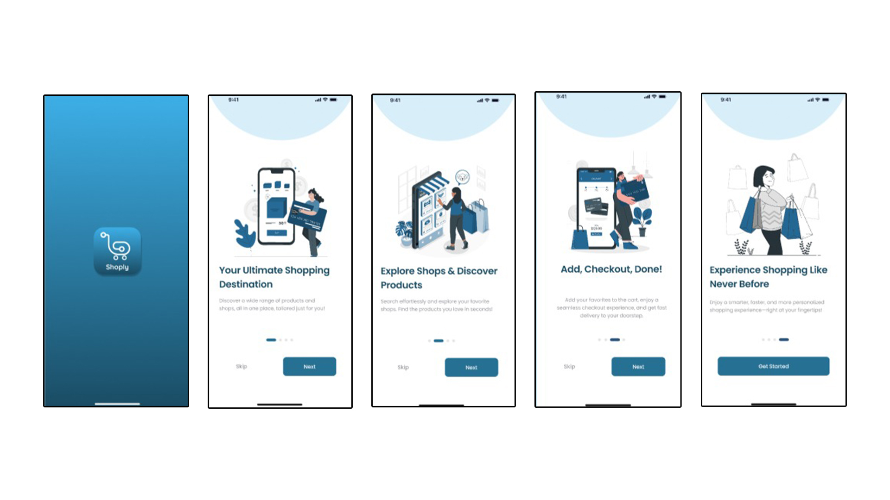
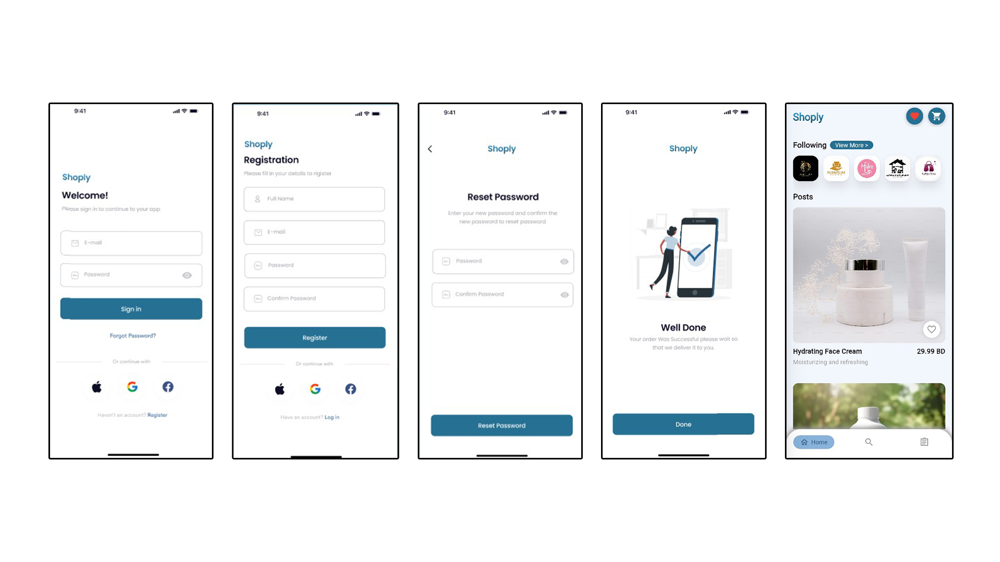
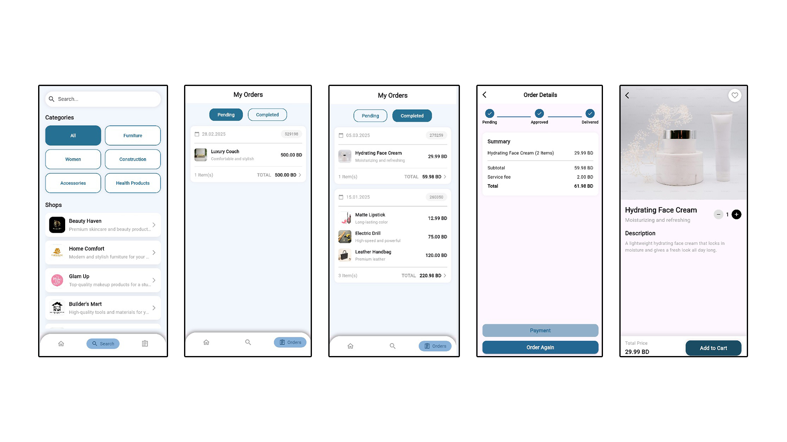
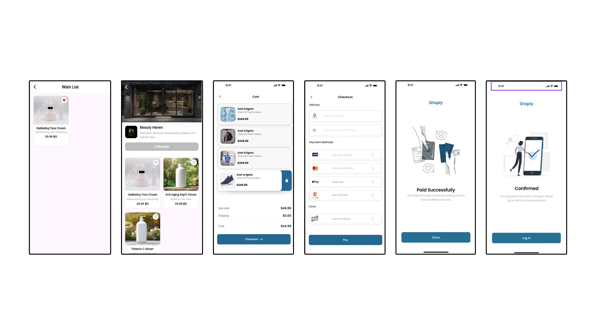
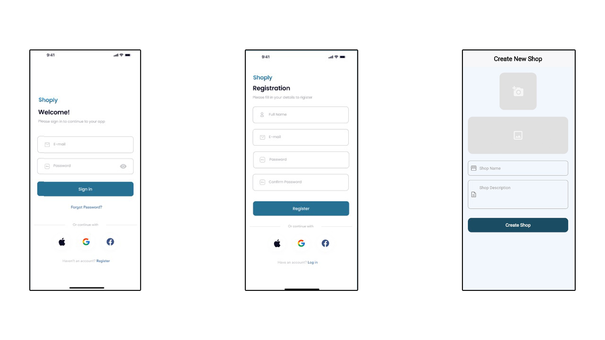
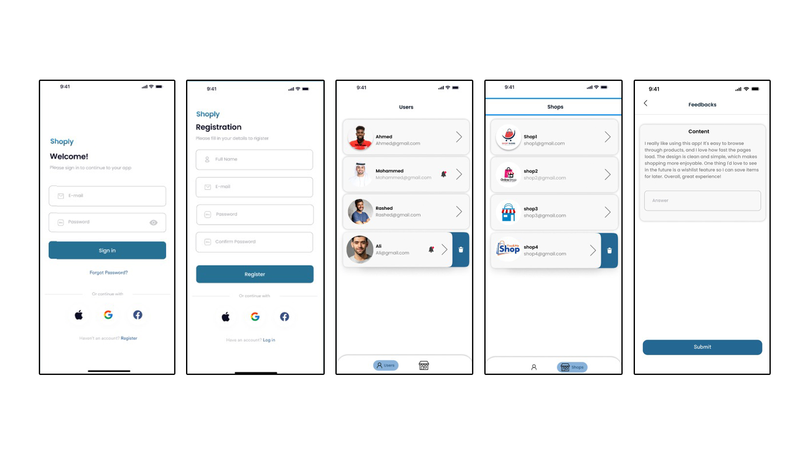

# Shoply - Multi-Vendor E-Commerce Mobile Application

## Overview

Shoply is a multi-vendor e-commerce mobile application developed using Flutter and Firebase. The application enables users to browse products, follow shops, manage orders, add items to a wishlist, and complete purchases through a seamless shopping experience.

The project was developed as a Software Engineering graduation project, focusing on modern mobile application development, user experience, and scalable system design.

---

## Features

### User Features

* User Registration & Authentication
* Login with Email and Password
* Password Reset
* Product Search & Browsing
* Shop Discovery & Following
* Wishlist Management
* Shopping Cart
* Secure Checkout Process
* Order Tracking
* Order History
* User Profile Management

### Shop Features

* Create and Manage Shops
* Upload Products
* Manage Product Listings
* Shop Profile Management

### Admin Features

* User Management
* Shop Management
* Feedback Monitoring
* System Administration

---

## Technologies Used

* Flutter
* Dart
* Firebase Authentication
* Cloud Firestore
* PostgreSQL
* REST APIs
* Git & GitHub

---

## Screenshots

### Application Overview













---

## Project Report

📄 Full project documentation is available here:

[Project Report](docs/Shoply_Report.pdf)

---

## Installation

1. Clone the repository

```bash
git clone https://github.com/AhKhamis/shoply-ecommerce-app.git
```

2. Navigate to the project directory

```bash
cd shoply-ecommerce-app
```

3. Install dependencies

```bash
flutter pub get
```

4. Run the application

```bash
flutter run
```

---

## Author

Ahmed Khamis

Software Engineering Graduate

University of Bahrain
